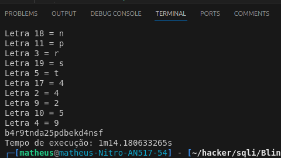

## Blind SQL Injection Automation
While trying to solve a blind sql injection lab on [Portswigger Academy](https://portswigger.net/web-security/sql-injection/blind/lab-conditional-responses/), I noticed that I would have to manually request so many times to only get the first letter of admin password, and there was 20
And despite that there is already a tool similar to the scripts I made on this repo on Burp Suite, called Intruder. It was very slow and hard to detect if there was the string "Welcome back" in the response that sinalizes that the sql query was succesfull and true.

Then I made a python script that succesfully got the password and I solved the lab! But where does the go scripts come in this story?
So after a long time after I solved this lab I keep studying hacking and then I got on this channel where a brillant coder/hacker called "tomnomnom" explained how he does recon and how he search for web vulnerabilities. I was amazed with his videos so I checked his channels and his tools, that he has a lot and are popular. And all of them are made in go, and are super fast.

After watching a lot of his videos and get amazed by his tools, I thought why don't I try to code that script I made in python but now in go. So I searched go documentation and I made some parts of the get started tour and I saw some examples written in go.
In the next day, I tried to read his code tool and surprisenly I did understand! I was so happy! Go is a really simple programming language with just few keywords but we can do a lot with it, specially cuncurreny which is complicated in other languages but on go is really eazy.

And that's the result of my scripts that did work out!
The first time execution with no cuncurrency was 10 minutes
Second time execution with cuncurrency was 1 minute
Finally the last and third time execution with cuncurrency and binary search was 10 seconds

I loved the journey of writting this scripts after a long time not coding so I posted here on github :)

## How to execute
- Go to [Portswigger Academy SQL lab](https://portswigger.net/web-security/sql-injection/blind/lab-conditional-responses/)
- Make an account
- Start the lab
- With developer tools, get session and trackingId cookie
- install go with ```sudo apt-get install golang```
- run ```go build {file that you want to build}```
- execute ```./{file that you want to execute} {url of the lab} {sessionCookie} {trackingIdCookie}```
- copy the output, which is the password, and then paste on the login page of the lab with the name **administrator**


### Results
Below are the images of the duration of each script, have a good day!
- 
- 
- 
