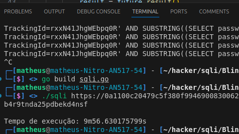
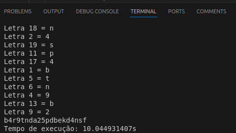

If you want to read in english, checkout this [README](./English_README.md)
## Automatização de Blind SQL Injection
Enquanto tentava resolver um laboratório de blind SQL injection na [Portswigger Academy](https://portswigger.net/web-security/sql-injection/blind/lab-conditional-responses/), percebi que teria que fazer várias requisições manualmente só para obter a primeira letra da senha de administrador, e havia 20 letras. Apesar de já existir uma ferramenta semelhante aos scripts que criei neste repositório no Burp Suite, chamada Intruder, ela era muito lenta e difícil de detectar se havia a string "Welcome back" na resposta, que sinalizava que a consulta SQL foi bem-sucedida e verdadeira.

Então, criei um script em Python que obteve a senha com sucesso e resolvi o laboratório! Mas onde entram os scripts em Go nessa história? Muito tempo depois de resolver esse laboratório, continuei estudando hacking e me deparei com um canal onde um programador/hacker brilhante chamado "tomnomnom" explicou como ele faz reconhecimento e busca por vulnerabilidades web. Fiquei impressionado com seus vídeos, então conferi seus canais e ferramentas, que são muitas e populares. E todas são feitas em Go, além de serem super rápidas.

Depois de assistir a muitos de seus vídeos e ficar impressionado com suas ferramentas, pensei: por que não tentar codificar aquele script que fiz em Python, mas agora em Go? Então procurei a documentação de Go, fiz algumas partes do tour "Get Started" e vi alguns exemplos escritos em Go. No dia seguinte, tentei ler o código da ferramenta dele e, surpreendentemente, entendi! Fiquei tão feliz! Go é uma linguagem de programação realmente simples, com poucas palavras-chave, mas com a qual podemos fazer muito, especialmente com concorrência, que é complicada em outras linguagens, mas em Go é muito fácil.

E esse é o resultado dos meus scripts que funcionaram! A primeira execução sem concorrência foi de 10 minutos. A segunda execução com concorrência foi de 1 minuto. Finalmente, a última e terceira execução com concorrência e busca binária foi de 10 segundos.

Adorei a jornada de escrever esses scripts depois de tanto tempo sem codificar, então publiquei aqui no GitHub :)

## Demonstração
https://github.com/user-attachments/assets/975a430e-4257-4430-8d60-85d901c3a98c

## Como executar:
- Vá para o [laboratório de SQL na Portswigger Academy](https://portswigger.net/web-security/sql-injection/blind/lab-conditional-responses/)
- Crie uma conta
- Inicie o laboratório
- Com as ferramentas de desenvolvedor, obtenha o cookie de sessão e o cookie trackingId
- Instale Go com ```sudo apt-get install golang```
- Execute ```go run {arquivo que você deseja compilar}```
- Copie a saída, que é a senha, e depois cole na página de login do laboratório com o nome "administrator"

## Resultados:
Abaixo estão as imagens da duração de cada script, tenha um bom dia!
- 
- 
- 
